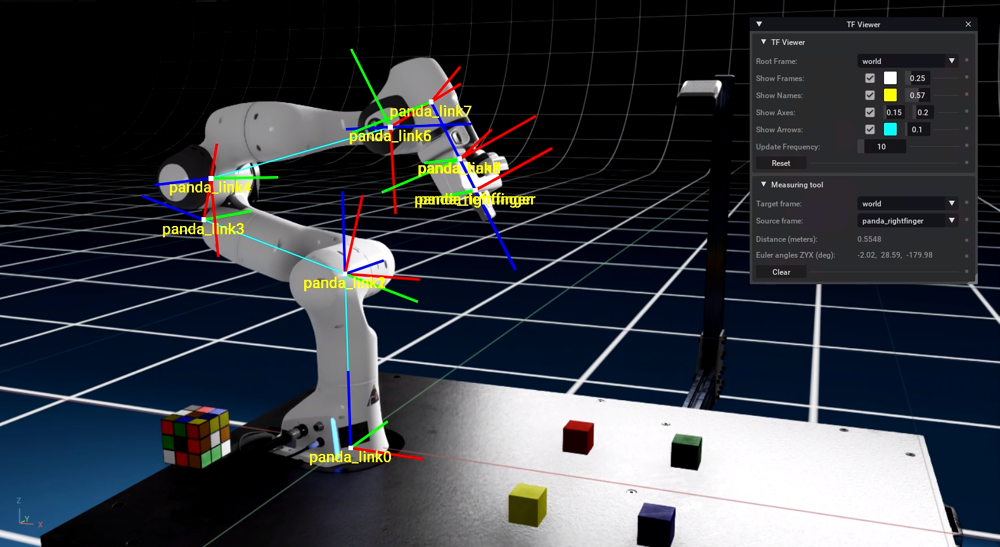

## TF Viewer

This extension displays in the viewpot window the tf transformation tree. As relevant information (optionally disabled), the name and axes of the frames as well as their connection to their parent frames are rendered. It is fully integrated with both ROS and ROS2.

<br>

**Target applications:** NVIDIA Omniverse Isaac Sim

**Supported OS:** Linux

**Changelog:** [CHANGELOG.md](exts/semu.robotics.tf/docs/CHANGELOG.md)

**Table of Contents:**

- [Extension setup](#setup)
- [Extension usage](#usage)
- [User interface](#ui)

<br>



<hr>

<a name="setup"></a>
### Extension setup

1. Add the extension using the [Extension Manager](https://docs.omniverse.nvidia.com/prod_extensions/prod_extensions/ext_extension-manager.html) or by following the steps in [Extension Search Paths](https://docs.omniverse.nvidia.com/py/kit/docs/guide/extensions.html#extension-search-paths)

    * Git url (git+https) as extension search path
    
        ```
        git+https://github.com/Toni-SM/semu.robotics.tf.git?branch=main&dir=exts
        ```

        To install the source code version use the following url

        ```
        git+https://github.com/Toni-SM/semu.robotics.tf.git?branch=main&dir=src
        ```

    * Compressed (.zip) file for import

        [semu.robotics.tf.zip](https://github.com/Toni-SM/semu.robotics.tf/releases)

2. Enable the extension using the [Extension Manager](https://docs.omniverse.nvidia.com/prod_extensions/prod_extensions/ext_extension-manager.html) or by following the steps in [Extension Enabling/Disabling](https://docs.omniverse.nvidia.com/py/kit/docs/guide/extensions.html#extension-enabling-disabling)

<hr>

<a name="usage"></a>
### Extension usage

Activating the window (*Window > Robotics > TF Viewer*) will start the TF visualization, if the transformations are available. The extension is compatible with both versions of ROS (ROS and ROS2) and will work automatically with the currently active version (`omni.isaac.ros_bridge` or `omni.isaac.ros2_bridge`).

Deactivating (closing) the window will clear the TF visualization.

<a name="ui"></a>
### User interface

<p align="center">
  
</p>

**TF Viewer**

1. Frame on which to compute the transormations
2. Whether the frames (markers) are displayed
   - Marker color
   - Marker size (relative)
3. Whether the frames' names are displayed
   - Text color
   - Text size (relative)
4. Whether the frames's axes are displayed (RGB -> XYZ axes)
   - Axis length (in meters)
   - Axis thickness (relative)
5. Whether to show the connection between the child frames and the parent frames
   - Line color
   - Line thickness (relative)
6. Frame transformation update frequency (Hz). Higher frequency may reduce simulation performance
7. Reset transformation tree (clear transformation buffers). Useful for `TF_OLD_DATA` warning, e.g. 

**Measuring tool**

8. The frame to which data should be transformed (target frame)
9. The frame where the data originated (source frame)
10. Distance between the frames from the transformation tree (in meters)
11. Rotation between the frames from the transformation tree (Euler angles ZYX)
12. Clear measurement and set frames to default
